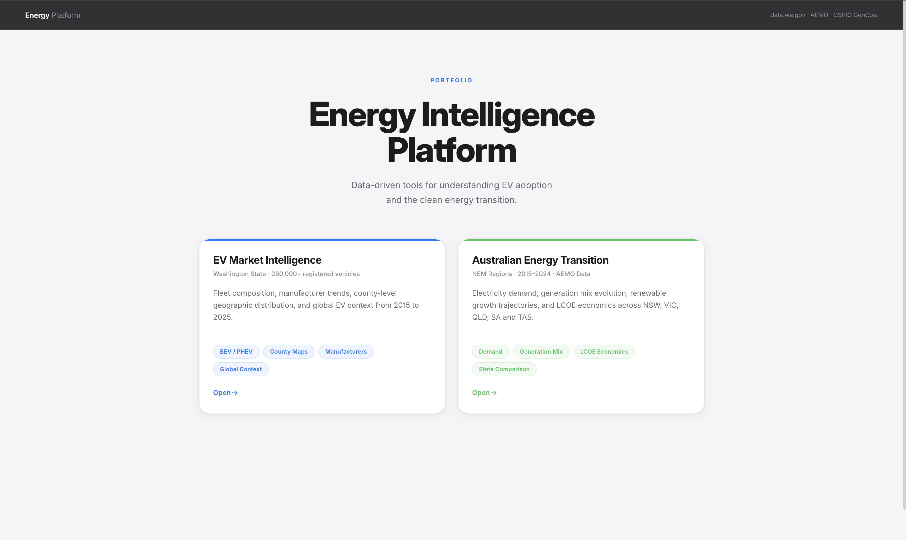
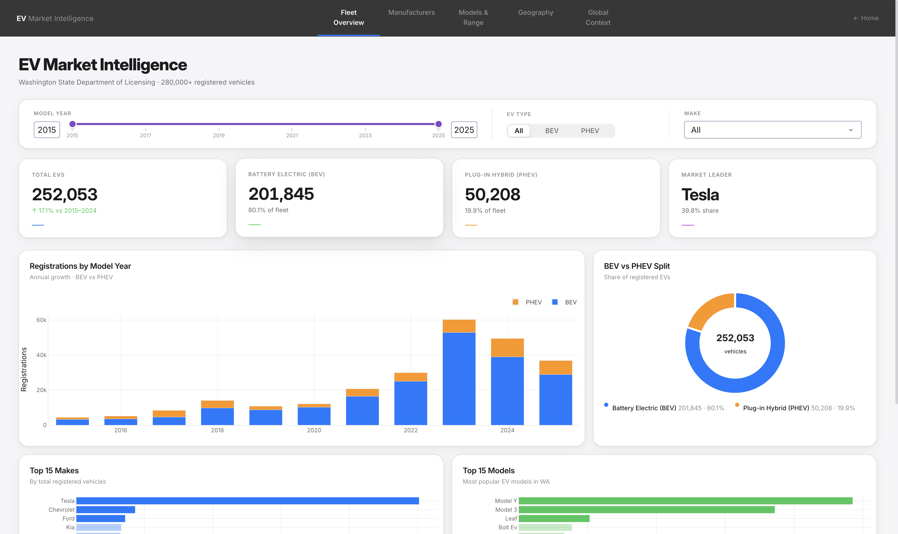
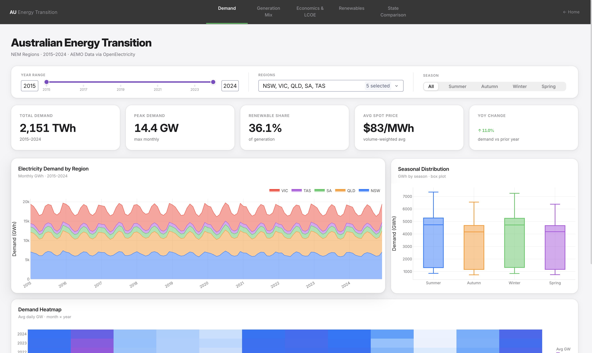

# Energy Intelligence Platform

A two-product data analytics platform built with Python, FastAPI, and Dash.

<!-- Screenshot placeholder -->



---

## Products

### 1 · EV Market Intelligence

Washington State EV registration data from the Department of Licensing — 280,000+ vehicles, 2015–2025.

**What it shows:**

- Fleet composition by model year, BEV vs PHEV split
- Manufacturer market share and registration trends
- Model range distribution and volume vs range scatter
- County-level geographic distribution (bubble map)
- Global EV context: sales by region, battery cost decline, WA share of US market

<!-- Screenshot placeholder -->



---

### 2 · Australian Energy Transition

NEM region data (NSW, VIC, QLD, SA, TAS) covering 2015–2024, showing the shift from coal to renewables.

**What it shows:**

- Electricity demand patterns by region and season
- Generation mix evolution — coal decline vs solar/wind growth
- LCOE economics: CSIRO GenCost 2024-25 cost trajectories and spot price crossover
- Renewable penetration by state and capacity factor heatmaps
- State comparison: radar chart, grouped generation bar, Australia map

<!-- Screenshot placeholder -->



---

## Tech Stack

| Layer       | Tools                                                         |
| ----------- | ------------------------------------------------------------- |
| Backend     | FastAPI, uvicorn                                              |
| Dashboards  | Dash 2.17, Plotly                                             |
| Data        | pandas, pyarrow (parquet)                                     |
| Caching     | Flask-Caching (SimpleCache)                                   |
| EV data     | Washington State DOL (CSV)                                    |
| Energy data | Synthetic (calibrated to AEMO) · Real API via OpenElectricity |
| LCOE data   | CSIRO GenCost 2024-25 (hardcoded constants)                   |
| Testing     | pytest, FastAPI TestClient, Flask test client                 |

---

## Project Structure

```
├── main.py                        # FastAPI entry point — mounts all apps
├── pytest.ini                     # Test configuration
├── core/                          # Shared design system
│   ├── design_tokens.py           # Colours, palette, energy source colours
│   ├── chart_factory.py           # Plotly layout helpers
│   └── layout_helpers.py          # Dash panel/row/KPI components
├── landing/                       # Landing page at /
├── products/
│   ├── ev_dashboard/              # Product 1 — served at /ev/
│   │   ├── app.py
│   │   └── data.py                # CSV load, _filter(), county coords, global sales
│   └── energy_dashboard/          # Product 2 — served at /energy/
│       ├── app.py
│       ├── data.py                # filter_demand/generation/prices helpers
│       └── callbacks/             # One file per tab
│           ├── cb_kpis.py
│           ├── cb_demand.py
│           ├── cb_generation.py
│           ├── cb_economics.py
│           ├── cb_renewables.py
│           └── cb_comparison.py
├── api/
│   ├── cache.py                   # In-memory parquet store (init_data, accessors)
│   └── routers/
│       ├── energy.py              # REST endpoints /api/energy/*
│       └── health.py              # /api/health
├── data_pipeline/
│   ├── config.py                  # Region codes, LCOE constants, season map
│   ├── 01_generate_synthetic_data.py   # Generates realistic 2015–2024 NEM data
│   ├── 01_fetch_openelectricity.py     # Fetches real data (free API key needed)
│   └── 02_clean_and_aggregate.py       # Cleans raw → final parquets
├── data/
│   └── energy/                    # Final parquet files (gitignored)
│       ├── raw/                   # Raw pipeline output (gitignored)
│       ├── demand_by_region.parquet
│       ├── generation_by_source.parquet
│       ├── prices_by_region.parquet
│       └── lcoe_estimates.parquet
└── tests/
    ├── conftest.py                # Shared fixtures (in-memory DataFrames, TestClient)
    ├── unit/
    │   ├── test_core.py           # design_tokens, _rgba, _chart, _bar_h
    │   ├── test_layout_helpers.py # _panel, _ph, _row, _kpi, _legend_row, _pill_label
    │   ├── test_landing.py        # Landing page layout tree, _product_card
    │   ├── test_tab_routing.py    # Tab content routing, EV/Energy layout structure
    │   ├── test_figures.py        # All 5 callback chart outputs (trace types)
    │   ├── test_cache.py          # api/cache accessors and schemas
    │   ├── test_energy_data.py    # filter_demand/generation/prices
    │   ├── test_ev_data.py        # EV CSV load, _filter, WA counties
    │   └── test_pipeline_config.py # LCOE constants, seasons, regions
    ├── integration/
    │   ├── test_api.py            # All REST endpoints (requires parquet files)
    │   └── test_callbacks.py      # Callback logic via patched in-memory data
    └── e2e/
        ├── test_pipeline_e2e.py   # Full pipeline run in tmp dir → schema checks
        └── test_browser.py        # Selenium tests (requires dash[testing])
```

---

## Running Locally

### 1. Install dependencies

```bash
pip install -r requirements.txt
```

### 2. Set up environment

```bash
cp .env.example .env
# Add your OpenElectricity API key if using real data (optional)
# OE_API_KEY=your_key_here
```

### 3. Generate energy data

**Option A — Synthetic data (recommended, no API key needed):**

```bash
python data_pipeline/01_generate_synthetic_data.py
python data_pipeline/02_clean_and_aggregate.py
```

**Option B — Real API data (last 12 months, requires free API key from [openelectricity.org.au](https://platform.openelectricity.org.au)):**

```bash
python data_pipeline/01_fetch_openelectricity.py
python data_pipeline/02_clean_and_aggregate.py
```

### 4. Add EV data

Place `ev_population.csv` from [Washington State DOL](https://data.wa.gov/Transportation/Electric-Vehicle-Population-Data/f6w7-q2d2) into `data/`.

### 5. Start the server

```bash
python main.py
```

Then open:

| URL                              | Page                         |
| -------------------------------- | ---------------------------- |
| `http://localhost:8050`          | Landing page                 |
| `http://localhost:8050/ev/`      | EV Market Intelligence       |
| `http://localhost:8050/energy/`  | Australian Energy Transition |
| `http://localhost:8050/api/docs` | REST API (Swagger)           |

---

## REST API

Available endpoints under `/api/energy/`:

```
GET /api/health
GET /api/energy/demand?region=NSW&year_from=2020&year_to=2024
GET /api/energy/generation?region=SA&source=solar_utility
GET /api/energy/prices?region=VIC&year_from=2022&year_to=2024
GET /api/energy/lcoe?technology=solar_utility
GET /api/energy/summary/{region}
```

---

## Testing

### Run all tests

```bash
pytest
```

### Run by layer

```bash
pytest tests/unit/          # 175 tests — no data files needed
pytest tests/integration/   # 46 tests  — requires parquet + ev_population.csv
pytest tests/e2e/           # 32 tests  — runs full pipeline in a temp directory
```

### Test coverage summary

| Layer                                 | Tests   | Requires                                     |
| ------------------------------------- | ------- | -------------------------------------------- |
| Unit — core design system             | 24      | nothing                                      |
| Unit — layout helpers                 | 40      | nothing                                      |
| Unit — landing page layout            | 13      | nothing                                      |
| Unit — tab routing & app layout       | 29      | ev_population.csv (EV tests skip without it) |
| Unit — chart callback outputs         | 32      | in-memory fixture                            |
| Unit — api/cache schemas              | 17      | in-memory fixture                            |
| Unit — energy data filters            | 19      | in-memory fixture                            |
| Unit — EV data & filter               | 21      | ev_population.csv (skipped without it)       |
| Unit — pipeline config constants      | 26      | nothing                                      |
| Integration — REST API endpoints      | 32      | parquet files (skipped without them)         |
| Integration — callback logic          | 14      | in-memory fixture                            |
| E2E — full pipeline → parquet schemas | 32      | nothing (generates data in tmp dir)          |
| **Total**                             | **299** |                                              |

### How Dash callbacks are tested

Dash wraps callbacks with context middleware — calling them directly requires injecting `outputs_list`. All chart callback tests (demand, generation, economics, renewables, comparison, KPIs) go through `POST /_dash-update-component` on the Flask test client, which is the same HTTP interface the Dash frontend uses. Responses are deserialized and trace types asserted without a browser.

### Browser tests (optional)

`tests/e2e/test_browser.py` contains Selenium tests that verify page render, tab switching, dropdown interactions, and JS console errors. These are skipped automatically if `dash[testing]` is not installed.

```bash
pip install "dash[testing]" selenium
brew install chromedriver   # macOS

pytest tests/e2e/test_browser.py --headed   # show browser window
pytest tests/e2e/test_browser.py            # headless
```

---

## Performance

### What's slow and why

When a user moves a filter slider, the energy dashboard must re-run data queries **and** rebuild all Plotly figure objects. Profiling on the synthetic dataset (10 years × 5 regions × monthly) showed:

**Per-callback breakdown (single interaction, uncached):**

| Step                            | Time      | % of total | Bottleneck? |
| ------------------------------- | --------- | ---------- | ----------- |
| Load parquet → pandas DataFrame | ~0.05 ms  | < 1%       | No          |
| pandas filter + groupby         | ~0.40 ms  | ~1%        | No          |
| Plotly figure construction (×1) | ~8 ms     | ~20%       | **Yes**     |
| Full tab response (4 figures)   | ~35–50 ms | 100%       | —           |

The data layer completes in under 0.5 ms. The remaining 35–49 ms is spent purely in Plotly building trace objects, computing axis ranges, and serialising to JSON — **none of which changes if the user triggers the same filter combination again**.

We evaluated three data-layer alternatives:

| Option           | Approach                  | Filter+groupby latency | Verdict                   |
| ---------------- | ------------------------- | ---------------------- | ------------------------- |
| pandas (current) | In-memory DataFrames      | ~0.44 ms               | Fastest at small scale    |
| DuckDB           | In-process SQL on parquet | ~0.72 ms               | Overkill; adds dependency |
| Polars           | Lazy evaluation           | ~0.51 ms               | Marginal gain; API churn  |

**Conclusion:** Replacing pandas with DuckDB or Polars saves < 0.3 ms per query while adding complexity. The correct optimisation is caching **complete figure outputs**, not changing the data layer.

### Solution: Flask-Caching (SimpleCache)

All six energy dashboard callbacks split into two layers:

1. `_compute_X(yr_range, regions, season)` — decorated with `@flask_cache.memoize(timeout=300)`. Runs the full query + figure build once, then stores the result tuple in memory for 5 minutes.
2. `cb_X(...)` — the Dash callback. Normalises args to hashable types (`tuple`) and delegates to `_compute_X`.

```python
# core/app_cache.py
from flask_caching import Cache
flask_cache = Cache()

# products/energy_dashboard/app.py
flask_cache.init_app(server, config={
    'CACHE_TYPE':            'SimpleCache',
    'CACHE_DEFAULT_TIMEOUT': 300,
})

# each callback file
@flask_cache.memoize(timeout=300)
def _compute_demand(yr_range, regions, season):
    ...  # heavy work, runs once per unique (yr_range, regions, season) combo

def register(app):
    @app.callback(...)
    def cb_demand(yr_range, regions, season):
        return _compute_demand(
            tuple(yr_range),
            tuple(sorted(regions or [])),  # normalised — order doesn't affect cache key
            season or 'All',
        )
```

**Why SimpleCache:** Single-worker dashboard (uvicorn), no cross-process sharing needed. Zero dependencies beyond `flask-caching`. Redis or Memcached would be appropriate if running multiple workers.

**Effect:** Repeated filter interactions with the same combination of year range / regions / season return cached figures in < 1 ms instead of ~35–50 ms. First load per unique filter set still pays the full cost.

<!-- Screenshot placeholder -->


---

## Future: Alternatives to Plotly

At current scale (monthly NEM data, ~600K rows) Plotly with caching is sufficient. The constraints that would force a change:

- **JSON serialisation** blows up above ~10K points per figure (can hit 5–20 s)
- **SVG rendering** degrades visibly past ~5K DOM nodes in the browser
- **No true streaming** — full figure must be rebuilt and re-sent on every update

| Library              | Rendering          | Python-native   | Large data             | Best for                                   |
| -------------------- | ------------------ | --------------- | ---------------------- | ------------------------------------------ |
| **Plotly (current)** | SVG / WebGL opt-in | Yes             | With `*gl` traces only | General dashboards + caching               |
| **Apache ECharts**   | Canvas by default  | Via pyecharts   | Yes, natively          | Real-time, high-volume; Sankey/treemap/geo |
| **Bokeh**            | Canvas / WebGL     | Yes             | Better than Plotly SVG | Streaming data; server-side downsampling   |
| **Altair**           | SVG                | Yes             | No (hard cap ~5K rows) | Declarative EDA charts in notebooks        |
| **D3.js**            | SVG / Canvas       | No (JavaScript) | Yes (canvas mode)      | Fully bespoke, JS-first teams              |

**ECharts** is the strongest long-term option — Canvas rendering, progressive loading, native streaming, and used in production by GitLab and OpenObserve as a direct Plotly replacement. Friction cost: it's JavaScript-only; Python integration via `pyecharts` or a custom Dash component.

**Bokeh** is the best Python-native alternative — server-side rendering means data is aggregated before leaving the server, and it supports WebSocket push. Downside: lower-level API and slower community growth than Plotly.

**Verdict:** ECharts if performance is critical and the team can write JS; Bokeh if staying Python-native with streaming; Plotly + caching for everything else at this scale.

---

## Data Sources

- **EV data** — Washington State Department of Licensing, [data.wa.gov](https://data.wa.gov)
- **Energy demand & generation** — AEMO via [OpenElectricity](https://openelectricity.org.au)
- **LCOE** — CSIRO GenCost 2024-25
- **Global EV sales** — IEA Global EV Outlook
- **Battery costs** — BloombergNEF
